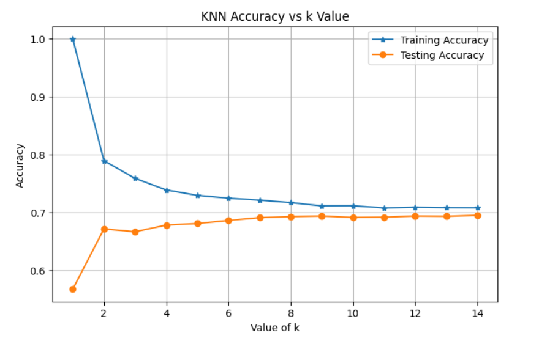

# 🏦 Loan Applicant Credit Risk Analysis using KNN

## 📌 Project Overview
Credit Risk Analysis is a key process used by banks and financial institutions to evaluate whether a loan applicant is likely to **repay a loan or default**.

This project applies the **K-Nearest Neighbors (KNN)** machine learning algorithm to classify loan applicants based on **financial and demographic attributes** such as age, work experience, city stability, cost-to-request ratio, and CIBIL score.

The project follows a complete **machine learning pipeline**, including data preprocessing, exploratory data analysis, model training, and hyperparameter tuning.

---

## 🎯 Objectives
- Analyze loan applicant data
- Perform data preprocessing and cleaning
- Conduct exploratory data analysis (EDA)
- Build a KNN-based credit risk classification model
- Tune hyperparameter **K**
- Evaluate model accuracy and performance

---

## 📂 Dataset Description
The dataset contains historical records of loan applicants.

### 🔑 Features
- Age  
- Total Work Experience  
- Years in Current City  
- Cost-to-Request Ratio  
- CIBIL Credit Score  

### 🎯 Target Variable
- **Total Bounces in the Past 12 Months**

This target represents repayment behavior and is used for credit risk classification.

---

## 🧠 Algorithm Used
### K-Nearest Neighbors (KNN)
- Supervised machine learning algorithm
- Distance-based classification
- Simple and interpretable
- Requires feature scaling for accurate results

---

## 🔄 Project Workflow
1. Data loading and inspection  
2. Handling missing values and preprocessing  
3. Exploratory Data Analysis (EDA)  
   - Scatter plot (Age vs Work Experience)  
   - Box plot (Age)  
   - Box plot (CIBIL Score)  
4. Feature selection and target definition  
5. Train–test data split  
6. Feature scaling using StandardScaler  
7. KNN model training  
8. Hyperparameter tuning (K = 1 to 14)  
9. Model evaluation  

---

## 📊 Model Performance Visualization

### 🔹 Training vs Testing Accuracy for Different K Values

The plot below shows how model accuracy varies with different values of **K**, helping identify the optimal balance between overfitting and underfitting.

  

### 📈 Key Observations
- Low K → Overfitting  
- High K → Underfitting  
- Optimal K → Best test accuracy with minimal gap  

---

## ✅ Results
- Feature scaling significantly improved KNN performance
- Optimal K value achieved stable and reliable accuracy
- KNN successfully classified loan applicants based on credit risk

---

## 🛠️ Technologies Used
- Python  
- Pandas  
- NumPy  
- Matplotlib  
- Seaborn  
- Scikit-learn  
- Jupyter Notebook  

---

## ⭐ Support
If you find this project useful, please ⭐ the repository!
